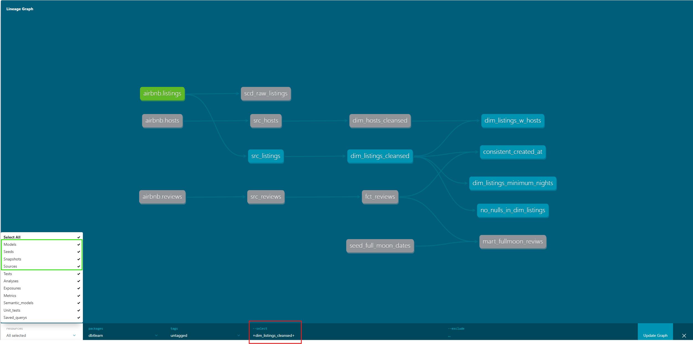

# Notities dbt Data Build Tool

## Algemeen
commando "dbt build": run models, test tests, snapshot snapshots, seed seeds.
commando "dbt --help": docs over dbt commando's. 
commando "dbt test --help": docs over "dbt test"
commando "dbt compile": generates executable sql from source model, test and analysis files. De compiled sql files zijn te vinden in de target folder. Je kunt hier o.a. mee checken of al je referenties e.d. correct zijn. 
commando "dbt parse": dbt just reads and validates your project code without connecting to the DWH. 
commando "dbt run": executes compiled sql against current target database
commando "dbt run --full-refresh" ofwel "dbt run -f": ververst een incrementeel model volledig ofwel reprocesses the entire incremental model. 
commando "dbt run-operation macro_name {args}": macro uitvoeren met de arguments van de macro in een dictionary, e.g. '{my_variable: my_value }
commando "dbt build --select state:modified+ --defer --state path/to/production/manifest.json": voorbeeld van "slim CI". alleen de veranderde modellen uitvoeren waarbij er gebruik gemaakt moet worden van de vorige manifest.json zodat er niet onnodig modellen opnieuw gebouwd moeten worden. "--state": Points to previous manifest (e.g., from production) to compare state and resolve refs. "--defer": Uses upstream models from the state manifest if they don't exist in the current environment. 

In folder models kun je meerdere .yml files opslaan met configuraties zoals tests (in schema.yml) en bronnen (in sources.yml). 

commando "dbt run" debuggen dmv van naar de scripts kijken die naar Snowflake gestuurd worden in folder ~/target/run/projectnaam/models/

seed: seeds are local files that you upload to the data warehouse using dbt. 
dbt seed: de files in de seed folder worden naar Snowflake ge-upload. 

source: data die al in het data warehouse zit. An abstraction on top of your input data. Sources can be defined in any .yaml file folder models. 

target/manifest.json is wellicht het belangrijkste bestand in je dbt project. Hier staat alles in: hooks, sql scripts, etc. Het is enigszins te vergelijken met bestand cdk.out/ServerlessAppStack.template.json binnen de AWS CDK. Om documentatie te genereren heb je eigenlijk alleen manifest.json nodig. 

## Snapshots
snapshots: kunnen gebruikt worden om historie bij te houden scd2 style. Twee typen snapshot strategies beschikbaar:
    - timestamp: a unique key and an updated_at field is defined on the source model. These columns are used for determining changes. 
    - check: any change in a set of columns (or all columns) will be picked up as an update. 
commando "dbt snapshot": maakt snapshots

## Tests
tests: los van custom tests (of tests van dbt packages), zijn er twee typen tests:
    - singular: sql queries die opgeslagen zijn in folder tests die een lege resultset moeten genereren.
    - generic: 4 typen: unique, not_null, accepted_values, relationships (relationships controleert of een kolom in tabel A een valid reference is naar een andere kolom in e.g. tabel B). Deze kunnen opgeslagen worden in folder models, bestand schema.yml. 
commando "dbt test": all tests uitvoeren
commando "dbt test --select dim_listings_cleansed": alleen tests uitvoeren die gerelateerd zijn aan model dim_listings_cleansed.
commando "dbt test --select dim_listings_minimum_nights": alleen test dim_listings_minimum_nights uitvoeren. 
De sql statement die dbt naar Snowflake stuurt om de tests te doen is te vinden in target\compiled\dbtlearn\models\schema.yml

## Macros
macros: soort van function. macros zijn jinja templates. Macros automate repetitive tasks, inject conditional logic, or simplify complex SQL operations (dus anders dan tests die met name bedoeld zijn voor validatie). They act like functions — defined once in .sql files (under macros/) and reused across models or other macros. 
macros kunnen ook gevonden worden in 3rd party packages op https://hub.getdbt.com/

## Packages
packages.yml kun je gebruiken om 3rd party packages toe te voegen aan je project. Deze packages stellen je in staat om e.g. macros te gebruiken die anderen ontwikkeld hebben e.g. de macro generate_surrogate_key(source) uit package dbt-utils. Nadat je packages.yml gemaakt hebt in je root moet je in de terminal nog commando "dept deps" uitvoeren om de dependencies (de packages dus in dit geval) te installeren. 
commando "dbt deps": installeert de packages uit packges.yml in folder dbt_packages\your_package_name. Feitelijk wordt de repo van de package simpelweg gecloned vanuit github naar de folder dbt_packages. 

## Documentation generation
documentation can be added to project.yml as a key-value pair. The key is "description" and the value is the documentation or description that you would like to add. You can add descriptions to models, columns. 
commando "dbt docs generate": genereert een html website in de target folder. 
commando "dbt docs serve": creëert een lightweight python documentatieserver om een documentatie pagina te maken. Een uitgebreidere documentatieserver zou op een nginx server gemaakt kunnen worden met de files in folder target. 
Door een .md bestand aan te maken in de models folder en aan deze te refereren in schema.yml mbv *description: '{{ doc("dim_listing_cleansed__minimum_nights") }}'* kun je uitgebreidere documentatie toevoegen aan je tabellen en kolommen. 
Je kunt plaatjes e.d. toevoegen aan documentatie o.a. dmv het aanmaken van een assets folder in de root en vervolgens in dbt_project.yml hiernaar te verwijzen mbv *asset-paths: ["assets"]*. Vervolgens wordt er in folder target een folder met naam "assets" aangemaakt met hierin het plaatje. Dit plaatje wordt dan gebruikt in de server. 
Er is op de docs server ook een DAG (Directed Acyclic Graph), oftewel een data lineage diagram aanwezig waarin je afhankelijkheden kunt zien. Je kunt in dit overzicht verschillende perspectieven creëeren. Je kunt bijvoorbeeld alleen de data gerelateerde objecten tonen mbv filters links onderin (groene kader op ss hieronder). Mbv +resource+ kun je alle afhankelijkheden die vooraf gaan aan de resource en alle resources die afhankelijk zijn van de resource tonen (rode kader op ss hieronder). 

## Analyses (ad hoc queries), Hooks and Exposures
Analyses (ad hoc queries), can be saved to the analyses folder. 
commando "dbt compile": checken of je referenties correct zijn voor model, test en analyses files. De compiled queries voor e.g. de analyses folder kun je terugvinden in folder target/compiled/dbtlearn/analyses. Je kunt deze queries mbv de extensie dbt Power User uitvoeren in VS Code zelf. 

## Hooks
hooks zijn SQLs die op vooraf gedefinieerde tijdstippen uitgevoerd worden. Hooks kunnen op project-, subfolder- of modelniveau ingesteld worden. Er zijn algemeen gesproken vier typen hooks:
- on_run_start: executed at the start of dbt (run, seed, snapshot)
- on_run_end: executed at the end of dbt (run, seed, snapshot)
- pre-hook: executed before a model/seed/snapshot is built
- post-hook: executed after a model/seed/snapshot is built
hooks need to be defined in dbt_project.yml (see dbt_project.yml for examples). 

## Exposures
exposures zijn configurations die naar externe resources verwijzen zoals dashboards e.d. In deze repo te vinden in dashboards.yml, maar je kunt het ook in een andere .yml verwerken. Je kunt in deze bestanden ook de afhankelijkheden weergeven zodat je weet van welke modellen een dashboard afhankelijk is, wat zeer inzichtelijk kan zijn. 
preset dashboard link: https://bf4d4ddb.us2a.app.preset.io/superset/dashboard/8/?edit=true&native_filters_key=0qkCTadz9TtUTWUAmJAFAahGaAlE4omMmWvGtcbjT6V_5lYg4Kt-L3u8qqEUUtx0

## Testing and data quality with package dbt-expectations
Original great expectations project: https://github.com/great-expectations/great_expectations
dbt-expectations: https://github.com/metaplane/dbt-expectations
Eerst package dbt-expectations toevoegen aan packages.yml. Vervolgens de functie/test die je wilt uitvoeren toevoegen aan schema.yml (tenzij het een test betreft die je op een source wilt doen, dan moet je de test toevoegen aan sources.yml). Documentatie van de functie/test is te vinden op de github pagina (e.g. welke parameters je wilt meegeven). 
Bekijk bij de documentatie altijd goed op welk objecttype de functie/test van toepassing is: e.g. op een tabel of kolom. 
commando "dbt --debug test --select source:airbnb.listings": debuggen van een test die uitgevoerd wordt op de brondata (en dus niet de modellen). Deze test wordt gedefinieerd in sources.yml (ipv schema.yml waar de tests op de models gedefinieerd worden). 
Betere manier om te debuggen van een test is te kijken welke sql dbt heeft gebruikt om de test uit te voeren. na e.g. "dbt test --select source:airbnb.listings" te kijken waar de compiled code/sql te vinden is. Dit wordt getoond aan het einde van een test: target\compiled\dbtlearn\models\sources.yml\dbt_expectations_source_expect_a60b59a84fbc4577a11df360c50013bb.sql

## Logging
In folder macros logging.sql toegevoegd. Vervolgens een blank slate maken dmv het deleten van dbt.log in folder logs. 
commando "dbt run-operation learn_logging": uitvoeren van de logging macro learn_logging in logging.sql in folder macros. 
In macro (logging.sql in dit geval), info=True toevoegen als tweede parameter van de log() functie zorgt ervoor dat de log message van level "debug" naar "info" gaat, net zoals in e.g. Python. Dit betekent dat het logging bericht ook in de terminal op het scherm komt. 

## Variables
Twee soorten variables:
- Jinja variables: variables die van jinja komen. 
- dbt variables/project variables: dbt-specific variables die via command line (CL) of door dbt_project.yml aan dbt doorgegeven kunnen worden. 
commando "dbt run-operation learn_variables": learn_variables macro wordt uitgevoerd. 
commando "dbt run --vars '{"key": "value"}': dbt variable doorgeven aan dbt via CL. 
https://docs.getdbt.com/docs/build/project-variables
Uitgebreide logica betreffende incremental load van fct_reviews.sql. Er zitten nu variabelen in. Deze variabelen krijgen een waarde met het volgende commando: 
dbt run --select fct_reviews  --vars '{start_date: "2024-02-15 00:00:00", end_date: "2024-03-15 23:59:59"}'
https://docs.getdbt.com/docs/build/incremental-strategy
Variables doorgegeven aan dbt via CL overschrijven variables die als defaults meegegeven zijn in dbt_project.yml. 

## Orchestratie met Dagster
Documentatie (zoek naar Dagster op deze pagina): https://github.com/nordquant/complete-dbt-bootcamp-zero-to-hero/blob/main/_course_resources/course-resources.md
Allereerst naar een hoger niveau in de directory tree gaan (dus naar folder dbt_course). Vervolgens een venv aanmaken met Python 3.11 (Python 3.12 zorgt voor problemen met package pendulum, wat een dependency is van dbt, geloof ik). Dus eerst Python 3.11 installeren (niet toevoegen aan PATH!). Hierna mbv python 3.11 een venv aanmaken: "C:\Alles\Programmas\Python311\python.exe" -m venv .venv
Na activatie van je venv de requirements.txt installeren in folder dbt_course. 
Je installeert Dagster in een directory hoger dan dbtlearn omdat je in het commando waarin je een nieuwe Dagster project maakt moet verwijzen naar de directory waarin je dbt project zit, denk ik. Commando om een nieuw Dagster project aan te maken is als volgt: dagster-dbt project scaffold --project-name dbt_dagster_project --dbt-project-dir=dbtlearn
scaffold is een "leeg" project aanmaken.
Je kunt hierna in C:\Alles\Repos\dbt_course\dbt_learn_dagster_project\dbt_learn_dagster_project\schedules.py het verversingsschema aanpassen. 
commando "DAGSTER_DBT_PARSE_PROJECT_ON_LOAD=1 dagster dev": Dagster laten integreren met je dbt project. Ook wordt er een lokale server gestart. Je moet wel in de dagster project folder zijn en je venv moet vanzelfsprekend geactiveerd zijn. 
Wanneer de server gestart is, kun je hier naartoe gaan met je browser. Op deze pagina, tabblad "Deployment" kun je op de knop "Materialize all" drukken om "dbt run" uit te voeren. 
In de server op tabblad "Overview" kun je naar het onderliggende tabblad "Schedules" gaan. Dit is het schedule wat gedefinieerd is in schedules.py. Default is dat het schedule uitstaat. Op deze pagina kun je het schedule aanzetten. 